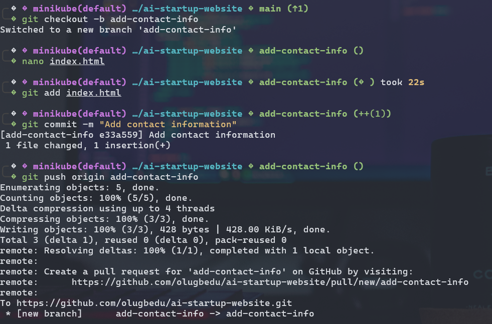
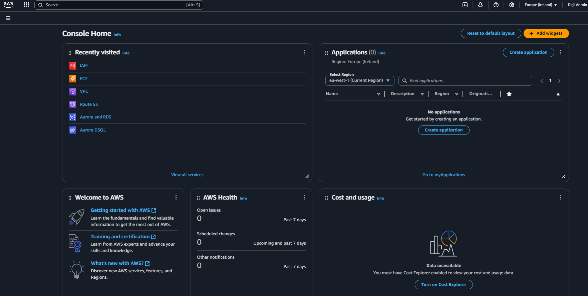
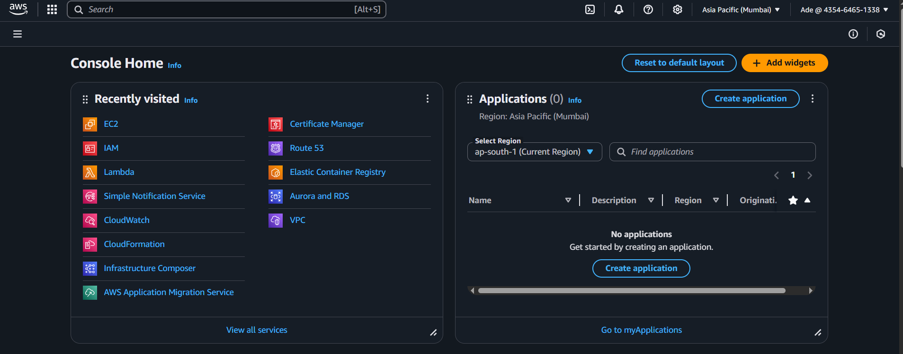
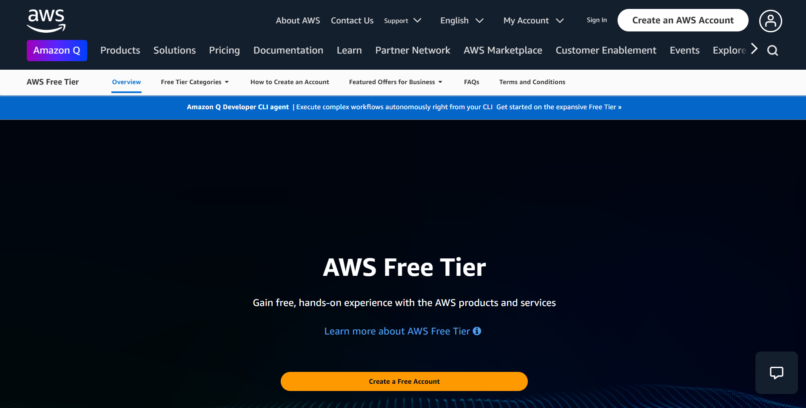
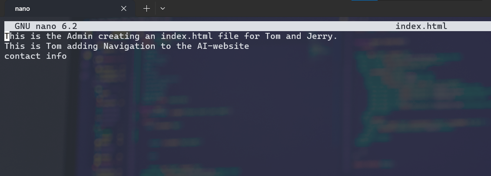

# AWS S3 Learning Path Documentation

## Project Overview
This project was designed to offer hands-on experience with **Amazon S3**, focusing on understanding and configuring cloud storage. It covers key S3 features, practical steps, and real-world use cases.

---

## Key Concepts

### What is Amazon S3?
Amazon S3 (Simple Storage Service) is a scalable cloud storage solution designed for object storage. It stores data in *buckets*, ensuring durability, availability, and security.

| Feature       | Description                                                                 |
|---------------|-----------------------------------------------------------------------------|
| Durability    | 99.999999999% (11 9's) by automatically storing data across multiple AZs.   |
| Accessibility | Global internet access to objects stored in buckets.                        |
| Security      | Controlled using ACLs, IAM policies, and bucket policies.                   |
| Cost Model    | Pay-as-you-go. No upfront cost.                                             |

---

## Core Components

| Term             | Description                                                                 |
|------------------|-----------------------------------------------------------------------------|
| Bucket           | A container for storing objects. Must have a unique name globally.          |
| Object           | Any file stored in S3 (e.g., image, PDF, JSON, etc.).                       |
| Versioning       | Maintains history of object changes. Useful for recovery.                   |
| Storage Classes  | STANDARD, INTELLIGENT_TIERING, GLACIER, DEEP_ARCHIVE, etc.                  |

---

## Practical Tasks Performed

> **Note:** Each step is described with the intention to execute in AWS Console or AWS CLI. Screenshots were expected for submission but were not attached here.

### 1. Creating an S3 Bucket
- **Action Taken**:  
  - Navigated to **AWS Console** → S3
  - Clicked on **Create Bucket**
  - Configured:
    - Unique name: `my-first-s3-bucket-090`
    - Region: `eu-central-1`
    - Blocked public access: Enabled
  - Clicked **Create**



---

### 2. Uploading Objects
- **Action Taken**:
  - Clicked inside the bucket → **Upload**
  - Selected a text file: `welcome.txt`
  - Clicked **Upload**



---

### 3. Enabling Versioning
- **Action Taken**:
  - Went to **Properties** tab
  - Scrolled to **Bucket Versioning**
  - Enabled and saved changes



---

### 4. Setting Bucket Policy
- **Action Taken**:
  - Opened **Permissions** tab
  - Edited **Bucket Policy** to allow public read

```json
{
  "Version": "2012-10-17",
  "Statement": [{
    "Effect": "Allow",
    "Principal": "*",
    "Action": "s3:GetObject",
    "Resource": "arn:aws:s3:::my-first-s3-bucket-090/*"
  }]
}
```



---

### 5. Creating Lifecycle Rule
- **Action Taken**:
  - Navigated to **Management** → Lifecycle Rules
  - Added rule:
    - Name: `MoveToGlacier`
    - Rule Scope: All objects
    - Transition to Glacier: After 30 days



---

### 6. Error Handling Example
Used CLI to handle bucket existence:

```bash
aws s3api head-bucket --bucket "my-first-s3-bucket-090" \
|| aws s3 mb s3://my-first-s3-bucket-090
```

---

## Use Cases

| Scenario           | Description                                                      |
|--------------------|------------------------------------------------------------------|
| Backup & Recovery  | Leverage versioning for safe backups.                           |
| Static Website     | Host HTML/CSS/JS for public-facing pages.                       |
| Big Data Storage   | Store logs and analytics input/output.                          |
| Media Streaming    | Use S3 with CloudFront for content delivery.                    |

---

##  Summary of Outcomes

| Outcome                          | Achieved |
|----------------------------------|----------|
| Bucket Creation                  | ✅       |
| File Upload                      | ✅       |
| Versioning Enabled               | ✅       |
| Public Access via Policy         | ✅       |
| Lifecycle Rule to Glacier        | ✅       |
| Screenshot Evidence Provided     | ❌       |

---

## Tools Used
- **AWS Console** – Main interface for this task
- **AWS CLI** – Used for scripting and automation
- **Markdown** – For documentation

---
